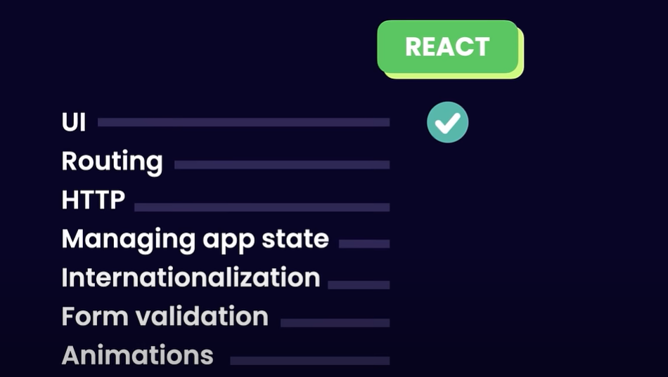
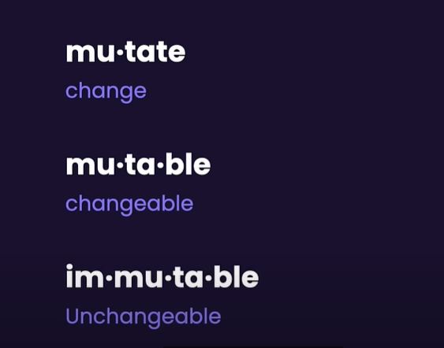
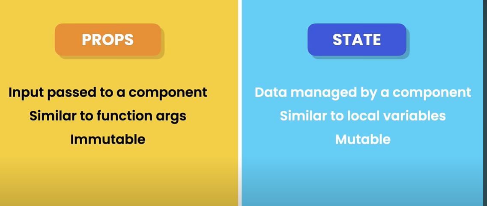
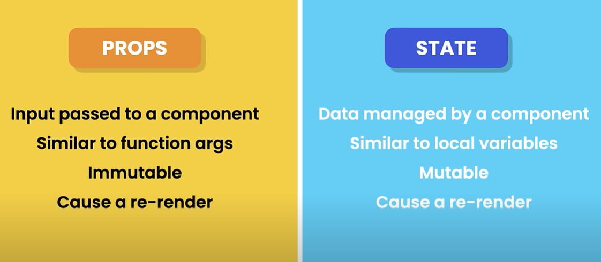

# "npm run dev"

Angular and React are both popular frameworks/libraries used for building web applications, but they have some significant differences in terms of their design philosophy, architecture, and usage. Here's a breakdown of the main differences:

1. Type:
Angular: It's a full-fledged framework. Angular is a comprehensive solution that provides everything you need to build a web application, including routing, state management, HTTP requests, and form handling.

React: It's a JavaScript library for building user interfaces. React is primarily focused on the "view" layer (i.e., rendering UI), and doesn't include all the features that Angular does out of the box. For more complex tasks like routing or state management, you typically need additional libraries (e.g., React Router, Redux, or Context API).

2. Rendering:

Angular:(Follows an MVVM (Model-View-View Model) architecture) Uses two-way data binding, which means the model (data) and view (UI) are automatically synchronized. If data changes, the view updates, and if the user interacts with the view, the model gets updated.

React: Uses one-way data binding. Data flows in one direction from parent to child components, and any updates to the view are done via state changes and rendering the UI using the render() method (or JSX)

3. Diff
Summary of Key Differences:
Feature    	|                 Angular	       |            React
Type	        |            Full framework	       |  Library for building UIs
Language	| TypeScript (also supports JavaScript)|  JavaScript (often with JSX, can use TypeScript)
Data Binding	| Two-way data binding	               |  One-way data binding


4. Next.js:

Next.js is a popular React framework that provides an opinionated set of tools to enhance the development of React applications


## Even thought angular is fullyfledged framework why most of them use react?
- cuz, it is simpler to learn
- gives developers more flexibility in choosing tools
- beacause of Virtual DOM(angular doesnot use it)
### Virtual DOM:
- It represents the structure of webpage in the browser. 
- Every time something changes in the app (like updating text or adding an element), the DOM needs to be updated
- #### Updating the real DOM directly can be slow because:
- The browser has to re-render the entire UI (or large parts of it).
- This can cause delays, especially in dynamic applications with frequent changes.
- ####  How Virtual DOM Improves Performance:
- React's Virtual DOM is a lightweight copy of the real DOM. It's like a virtual "shadow" of the actual UI.
- React makes changes to the Virtual DOM first, instead of directly updating the real DOM. Afterward, React compares the new Virtual DOM with the previous one (this is called "reconciliation").
- Efficient Updates: React only updates the parts of the real DOM that actually changed, rather than re-rendering everything. This selective update process is much faster.


# React Course:

- PreRequisites: html,css and JS

## TypeScript: 
- is a supetset of JavaScript(means it adds features to JS)
- It catches errors before running(Type errors are caught at complie time not runtime)
- Better Development Experience- like autocompletes and better error checking
- Type Safety(can define types for vars and functions)

# React:
- is a JS librabry for building dynamic and interactive user interfaces.
- created at facebook in 2011
- and mostly used jS librabry for front end development(other JS libraries--angular and vue)
- ReactNative is used for building mobile app using react 
- Native is a framework

## Why React is created?

- when the webpage is loaded in a browser the browser takes the html file and creates a tree like structure called DOM(Document Object Model)
- Vanilla JS- pure Js without any framerworks like react or angular.
- with vanilla JS we can create a webapp but it it is difficut like managing large data or doesn't have inbuilt features(like routing) or takes more time for running the app or getting the response or faster development.


###  What is Angular?
Angular is a full-fledged frontend framework developed and maintained by Google. Unlike React (which is just a UI library), Angular comes with everything you need to build a large-scale application out of the box.


# 🧠 In React:
- You don’t deal directly with the DOM (like document.querySelector() or document.createElement()).
- Instead, you build components — small, reusable chunks of UI.
- React handles turning your components into real DOM elements behind the scenes using something called the Virtual DOM.

# 🔁 So the full cycle looks like:

  Your Component Code (JSX)
        ⬇
  React builds Virtual DOM
        ⬇
  React compares to previous VDOM
        ⬇
  React updates Real DOM efficiently

# Components:
- they help us to write reusable, modular and better organized code.
  ## Modular means:
     - Modular code means writing your code in small, self-contained pieces (modules) that each do one thing well and can be reused anywhere.

- we will create all the components induvidullay and combined to create the app.
- a react application is a tree of components with app being the root
- 


# 🧠 Diif ways to create React App:

## 🟦 Create React App (CRA)
- 🧑‍🎓 Best for beginners
- Simple, one-command setup
- Good for small/medium SPAs
- BUT: Not very modern or flexible (slow dev builds)

## 🟩 Vite
- ⚡ Super fast build and dev server
- Modern setup with native ES modules
- Ideal for most new React projects
- Easy to customize
- Requires manual routing setup (like CRA)

## 🟪 Next.js
- 🧠 Advanced framework for production
- Built-in routing, SSR, static generation, and more
- Great for apps that need SEO or backend functionality
- Slightly steeper learning curve, but powerful


# File Structure:
## Node Modules:
- this is where all the third party librbaries like react and other tools are installed
## public:
- this is where public assests exists like images and video files
## src:
- components
## package.json
- contains info about prj like name, version and dependencies
## tsconfig.json
- bunch of setting for telling the ts compiler how to compile our code to js


# entry Point of Application
- main.tsx is the entry point.

- extension for ts id .ts or .tsx
- we can't use .tsx extension in angular only allowed in react
- ## What is TSX?
- TSX is JSX with TypeScript. It is used when you want to write React code in TypeScript, and it allows you to use JSX syntax with TypeScript features like type-checking.
- TSX is just like JSX, but it is used when you’re writing your React code in TypeScript (instead of JavaScript).
- It helps you take advantage of TypeScript’s type safety features while writing React components.
- we will put .ts for place ts file and .tsx for react typescript files
- PascalCasing is the convention used in react measns every word start with capital like Message, TypeScript
- jsx code is convert into pure js while we write jsx code in our components

------------------------------------------------------------------------

- if we create aany components we should use it in app components
 ``` ts
 function Message()
{
    return <h1>Hello world❤️🎊🥳</h1>
}
export default Message

// App component
import Message from './Message'
function App()
{
  return <div><Message></Message></div>
}
export default App


 ```

 - jsx allows to change the data dynamically


-----------------------------------------------------------------------------

# How React Works:
- so currently we have 2 components app and message 
- when our app starts react takes these 2 componennts and converts into virtual DOM
- 
- the virtual dom is light weighted copy of actual dom when any components data changes the virtual dom component will changes and it will compare the VDOM with actual DOM and changes only that component instead of re-rendering the entire page.
- this updating is not done by react but done by a librabry called react DOM

----------------------------------------------------------------------

# React Ecosystem:
- React is a jslibrabry for building user interfaces.
- react is library and angular/vue are frame works
- 
- 
- library is like tool and frame work is like tool structure
- react is only used for UI for other things we need additional tools for below things


------------------------------------------------------------------------
# ListGroup components:
## Bootstarp:
- is a popular CSS library gives us a bunch of css classes for stryling our application.
- Installation steps:
- npm i bootstrap@5.3.3
- in main.tsx instaed of import index.css replace with 'bootstrap/dist/css/bootstrap.css'

-----------------------------------------------------------
# Fragments:

- In react a component can't return more than one element
- when we write <h1>Hello</h1> // will bw converted in js like React.createElement('h1)
- since we can't return more than one element one possible solution is wrapping the entire in div element
- instaed of this we can use fragment instaed of adding unncessary element
- To use framgment we can import it from react and in place of div we can keep fragment
- ex: import {Fragment} from "react";
<Fragment>
// 2 elements
</Fragment>

or

- we can directly use empty elemets without even importing 
- that tells that we are using framgment


---------------------------------------------------------------------------
# Rendering Lists:
- in react we use {} to render data dynamically
- for now we are keeping the data in list hardcoded but if we want to keep them dynamically 
``` ts
function ListGroup() {
    return (
        <>
            <h1>List</h1>
            <ul className="list-group">
                <li className="list-group-item">An item</li>
                <li className="list-group-item">A second item</li>
                <li className="list-group-item">A third item</li>
                <li className="list-group-item">A fourth item</li>
                <li className="list-group-item">And a fifth one</li>
            </ul>
        </>
    )
}
export default ListGroup
```
- then we will use map in js.

```ts
function ListGroup() {

    const items = ["Tokyo", "Paris", "Nairobi", "São Paulo", "Vancouver"]

    return (
        <>
            <h1>List</h1>
            {items.map((item) => (<li>{item}</li>))}
        </>
    )
}
export default ListGroup
```

- and here we haven't given any key for the each list item and we should give unique key property for each item so that we can uniquely identify that item like if we want to change anything for that particular item, we can use that unique kep property
----------------------------------------------------------------------
# 🔍 What is Rendering?
- Rendering refers to the process of displaying content on the screen. In web development, it’s the process of converting code (like HTML, JavaScript, and CSS) into the final visual elements you see on the page.

# 🌍 In Web Development:
- Rendering is the browser's job. It takes the HTML, CSS, and JavaScript, then renders (displays) it visually on the page.

- In simpler terms: rendering = turning your code into what you see on your screen

---------------------------------------------------------

# Conditional Rendering:
- only on particular condition we have to render the data on screen
- Conditional rendering is a concept in React (and web development in general) where certain content or components are displayed based on specific conditions (like state, props, or other logic).

- In simpler terms, it means: "show this if something is true, or show something else if it’s false."

- ex:
```ts
function ListGroup() {
    let items: any = []
    // items = ["Tokyo", "Paris", "Nairobi", "São Paulo", "Vancouver"]
    if (items.length === 0) return <><h1>List</h1><p>No items found</p></>
    else {
        return (
            <>
                <h1>List</h1>
                <ul className="list-group">
                    {items.map((item: any) => (<li key={item}>{item}</li>))}
                </ul>
            </>
        )
    }

}
export default ListGroup
```
- since the above code has duplication we will add a ternary operator
```js
function ListGroup() {
    let items: any = []
    // items = ["Tokyo", "Paris", "Nairobi", "São Paulo", "Vancouver"]
    // if (items.length === 0) return <><h1>List</h1><p>No items found</p></>
    const message = items.length === 0 ? <p>No items Found!</p> : null

    return (
        <>
            <h1>List</h1>
            {message}
            <ul className="list-group">
                {items.map((item: any) => (<li key={item}>{item}</li>))}
            </ul>
        </>
    )

}
export default ListGroup
```
- to even modify this we can use function caz in future if we want we can pass any arguments and we can resue it 
```js
function ListGroup() {
    let items: any = []
    // items = ["Tokyo", "Paris", "Nairobi", "São Paulo", "Vancouver"]
    // if (items.length === 0) return <><h1>List</h1><p>No items found</p></>

    const getMessage = () => {
        return items.length === 0 ? <p>No items Found!</p> : null
    }
    return (
        <>
            <h1>List</h1>
            {getMessage()}
            <ul className="list-group">
                {items.map((item: any) => (<li key={item}>{item}</li>))}
            </ul>
        </>
    )

}
export default ListGroup
```
- true && 1 // 1
- true && "react" // react

--------------------------------------------------------------------
# Handling Events:
- like click envents
- in react every element has onClick event 
```js
                {items.map((item: any) => (<li className="list-group-item" key={item} onClick={() => console.log("clicked on", item)}>{item}</li>))}

```

# Type Annotation:
 - In TypeScript, a type annotation is how you explicitly tell the compiler what type a variable, function parameter, or return value should be. It’s one of the core features of TypeScript that adds type safety to JavaScript.
 - if we define the type for anyvar we can see the auto complete

 # Event Handler:
 ```js
 <button onclick="handleClick()">Click Me</button>

<script>
  function handleClick() {
    alert("Button was clicked!");
  }
</script>
onclick="handleClick()" → tells the browser: when this button is clicked, run handleClick.

handleClick() is the event handler for the click event.
```

------------------------------------------------------------------------------

# Managing State:

- I want to heighlight the item which is being clicked at a time for that we ca use active class name 
```js
    {items.map((item: any) => (<li className="list-group-item active" key={item} onClick={handelClick}>{item}</li>))}
```

- to heightlight the item when it is clicked on 
```js
function ListGroup() {
    let items: any = []
    items = ["Tokyo", "Paris", "Nairobi", "São Paulo", "Vancouver"]
    // if (items.length === 0) return <><h1>List</h1><p>No items found</p></>
    let selectedIndex = -1;// 0 means 1st item so -1
    const getMessage = () => {
        return items.length === 0 && <p>No items found</p>
    }
    const handelClick = (item: any) => {
        console.log(item)
        selectedIndex = items.indexOf(item);
    }
    return (
        <>
            <h1>List</h1>
            {getMessage()}
            <ul className="list-group">
                {items.map((item: any, index: any) => (<li className={selectedIndex === index ? "list-group-item active" : "list-group-item"} key={item} onClick={() => { selectedIndex = index }}>{item}</li>))}
            </ul>
        </>
    )

}
export default ListGroup
```
- this doesn't work because of the selectedIndex var
- You're using a regular variable (selectedIndex = -1) to track the selected item.
- However, React needs state to keep track of values and automatically update the UI when something changes.
- A regular variable (like selectedIndex) doesn't tell React to update the component when its value changes. This is why the highlighting is not working.
- To overcome this problem we have to tell react that this component is having data that can  change over time
- To do that we ahve to use one of the buit in function called "useState"
- This is called Hook this will allow us to use the built in fns in react
- Instead of writing a var 
```js
const arr=useState(-1)// -1 is the initial value and it returns an array
arr[0]// var like selectedIndex
arr[1]// updater function
// using updater function we can update the var then react will get notified like there is a change in the var then it will rerender that compomnent
```
- this is the update code for heighlighting

```js
import { useState } from "react";

function ListGroup() {
    let items: any = []
    items = ["Tokyo", "Paris", "Nairobi", "São Paulo", "Vancouver"]
    // if (items.length === 0) return <><h1>List</h1><p>No items found</p></>
    // let selectedIndex = -1;// 0 means 1st item so -1
    const getMessage = () => {
        return items.length === 0 && <p>No items found</p>
    }
    const [selectedIndex, setSelectedIndex] = useState(-1);

    return (
        <>
            <h1>List</h1>
            {getMessage()}
            <ul className="list-group">
                {items.map((item: any, index: any) => (<li className={selectedIndex === index ? "list-group-item active" : "list-group-item"} key={item} onClick={() => { setSelectedIndex(index) }}>{item}</li>))}
            </ul>
        </>
    )

}
export default ListGroup
```
- So when the we click the onClick even is triggered it will call the setSelectedIndex function and updates the selectIndex to the parameter passed to that method
- each component has diff state lets say we have another component in app.tsx those 2 components will have diff states
```js
import ListGroup from './components/ListGroup'
function App() {
  return <div>
    <h1>MY APP</h1>
    <ListGroup />// will have diff state
    <ListGroup />// will have diff state
  </div>
}
export default App
```

# Passing Data via Props:
- now we are displaying the list of cities in list but what if we want to display list of names/colors then we use props for that to make the component reusable
- Props are inputs to our component
- we will define the inputs in interface 
```js
interface Prop{
    items:string[];
    heading:string;
}
```
- we need to pass the data from app component
```js
    <ListGroup items={items} heading='Cities' />

import { useState } from "react";
interface ListGroupProps {
    items: string[];
    heading: string;
}


function ListGroup(props: ListGroupProps) {
    // if (items.length === 0) return <><h1>List</h1><p>No items found</p></>
    // let selectedIndex = -1;// 0 means 1st item so -1
    const { items, heading } = props;
    const getMessage = () => {
        return items.length === 0 && <p>No items found</p>
    }
    const [selectedIndex, setSelectedIndex] = useState(-1);

    return (
        <>
            <h1>{heading}</h1>
            {getMessage()}
            <ul className="list-group">
                {items.map((item: any, index: any) => (<li className={selectedIndex === index ? "list-group-item active" : "list-group-item"} key={item} onClick={() => { setSelectedIndex(index) }}>{item}</li>))}
            </ul>
        </>
    )

}
export default ListGroup
```

# Diff b/w Props and Interfaces:
## Props:
- Definition: Short for "properties", props are the actual data/values passed to a React component.

- Purpose: Used to customize a component’s behavior or display.

- Example:

```js
function Greeting(props: { name: string }) {
  return <h1>Hello, {props.name}!</h1>;
}

// Usage
<Greeting name="Alice" />
```

## Interfaces:
- Definition: A TypeScript feature used to define the shape of an object.

- Purpose: Helps with type checking and code readability.

- In React: Often used to define the type of props that a component expects.

- Example with interface:
```js
interface GreetingProps {
  name: string;
}

function Greeting(props: GreetingProps) {
  return <h1>Hello, {props.name}!</h1>;
}
```


# Passing functions via props:
- passing a function via props means when the use clicks on one of the list item something should happen like redirecting to another page or some thing like that
- for that we added one fn to the props
- and when click happens that fn should be called
- in the app component that fn is implemented
- then that will be executed
- siply means the fn that has to be executed when the button is clicked is written in app component for making the list group reusable
- and that fn is passed to the list grp component
- when it calld that fn when the item is clicked
```js
import { useState } from "react";
interface ListGroupProps {
    items: string[];
    heading: string;
    onSelectItem: (item: string) => void;
}


function ListGroup(props: ListGroupProps) {
    // if (items.length === 0) return <><h1>List</h1><p>No items found</p></>
    // let selectedIndex = -1;// 0 means 1st item so -1
    const { items, heading, onSelectItem } = props;
    const getMessage = () => {
        return items.length === 0 && <p>No items found</p>
    }
    const [selectedIndex, setSelectedIndex] = useState(-1);

    return (
        <>
            <h1>{heading}</h1>
            {getMessage()}
            <ul className="list-group">
                {items.map((item: any, index: any) => (<li className={selectedIndex === index ? "list-group-item active" : "list-group-item"} key={item} onClick={() => {
                    setSelectedIndex(index)
                    onSelectItem(item)
                }}>{item}</li>))}
            </ul>
        </>
    )

}
export default ListGroup
```
- App component

```js
import ListGroup from './components/ListGroup'
function App() {
  const items = ["Tokyo", "Paris", "Nairobi", "São Paulo", "Vancouver"];
  const handleOnSelectItem = (item: string) => {
    console.log(item);
  }
  return <div>
    <h1>MY APP</h1>
    <ListGroup items={items} heading='Cities' onSelectItem={handleOnSelectItem} />
  </div>
}
export default App
```
-----------------------------------------------------------
# State vs Props:
- 
- 
- we can change the props but it is the principla that we should not chnage it
- 

-------------------------------------------------
# Passing Children:
