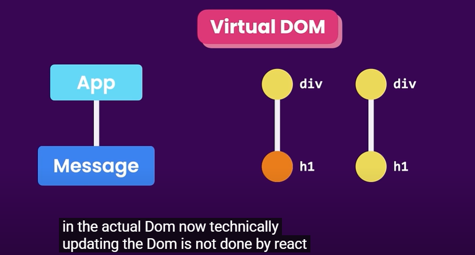

Angular and React are both popular frameworks/libraries used for building web applications, but they have some significant differences in terms of their design philosophy, architecture, and usage. Here's a breakdown of the main differences:

1. Type:
Angular: It's a full-fledged framework. Angular is a comprehensive solution that provides everything you need to build a web application, including routing, state management, HTTP requests, and form handling.

React: It's a JavaScript library for building user interfaces. React is primarily focused on the "view" layer (i.e., rendering UI), and doesn't include all the features that Angular does out of the box. For more complex tasks like routing or state management, you typically need additional libraries (e.g., React Router, Redux, or Context API).

2. Rendering:

Angular:(Follows an MVVM (Model-View-View Model) architecture) Uses two-way data binding, which means the model (data) and view (UI) are automatically synchronized. If data changes, the view updates, and if the user interacts with the view, the model gets updated.

React: Uses one-way data binding. Data flows in one direction from parent to child components, and any updates to the view are done via state changes and rendering the UI using the render() method (or JSX)

3. Diff
Summary of Key Differences:
Feature    	|                 Angular	       |            React
Type	        |            Full framework	       |  Library for building UIs
Language	| TypeScript (also supports JavaScript)|  JavaScript (often with JSX, can use TypeScript)
Data Binding	| Two-way data binding	               |  One-way data binding

4. Next.js:

Next.js is a popular React framework that provides an opinionated set of tools to enhance the development of React applications

## Even thought angular is fullyfledged framework why most of them use react?
- cuz, it is simpler to learn
- gives developers more flexibility in choosing tools
- beacause of Virtual DOM(angular doesnot use it)
### Virtual DOM:
- It represents the structure of webpage in the browser. 
- Every time something changes in the app (like updating text or adding an element), the DOM needs to be updated
- #### Updating the real DOM directly can be slow because:
- The browser has to re-render the entire UI (or large parts of it).
- This can cause delays, especially in dynamic applications with frequent changes.
- ####  How Virtual DOM Improves Performance:
- React's Virtual DOM is a lightweight copy of the real DOM. It's like a virtual "shadow" of the actual UI.
- React makes changes to the Virtual DOM first, instead of directly updating the real DOM. Afterward, React compares the new Virtual DOM with the previous one (this is called "reconciliation").
- Efficient Updates: React only updates the parts of the real DOM that actually changed, rather than re-rendering everything. This selective update process is much faster.

# React Course:

- PreRequisites: html,css and JS

## TypeScript: 
- is a supetset of JavaScript(means it adds features to JS)
- It catches errors before running(Type errors are caught at complie time not runtime)
- Better Development Experience- like autocompletes and better error checking
- Type Safety(can define types for vars and functions)

# React:
- is a JS librabry for building dynamic and interactive user interfaces.
- created at facebook in 2011
- and mostly used jS librabry for front end development(other JS libraries--angular and vue)
- ReactNative is used for building mobile app using react 
- Native is a framework

## Why React is created?

- when the webpage is loaded in a browser the browser takes the html file and creates a tree like structure called DOM(Document Object Model)
- Vanilla JS- pure Js without any framerworks like react or angular.
- with vanilla JS we can create a webapp but it it is difficut like managing large data or doesn't have inbuilt features(like routing) or takes more time for running the app or getting the response or faster development.

###  What is Angular?
Angular is a full-fledged frontend framework developed and maintained by Google. Unlike React (which is just a UI library), Angular comes with everything you need to build a large-scale application out of the box.

# 🧠 In React:
- You don’t deal directly with the DOM (like document.querySelector() or document.createElement()).
- Instead, you build components — small, reusable chunks of UI.
- React handles turning your components into real DOM elements behind the scenes using something called the Virtual DOM.

# 🔁 So the full cycle looks like:

  Your Component Code (JSX)
        ⬇
  React builds Virtual DOM
        ⬇
  React compares to previous VDOM
        ⬇
  React updates Real DOM efficiently

# Components:
- they help us to write reusable, modular and better organized code.
  ## Modular means:
     - Modular code means writing your code in small, self-contained pieces (modules) that each do one thing well and can be reused anywhere.

- we will create all the components induvidullay and combined to create the app.
- a react application is a tree of components with app being the root
- 

# 🧠 Diif ways to create React App:

## 🟦 Create React App (CRA)
- 🧑‍🎓 Best for beginners
- Simple, one-command setup
- Good for small/medium SPAs
- BUT: Not very modern or flexible (slow dev builds)

## 🟩 Vite
- ⚡ Super fast build and dev server
- Modern setup with native ES modules
- Ideal for most new React projects
- Easy to customize
- Requires manual routing setup (like CRA)

## 🟪 Next.js
- 🧠 Advanced framework for production
- Built-in routing, SSR, static generation, and more
- Great for apps that need SEO or backend functionality
- Slightly steeper learning curve, but powerful

